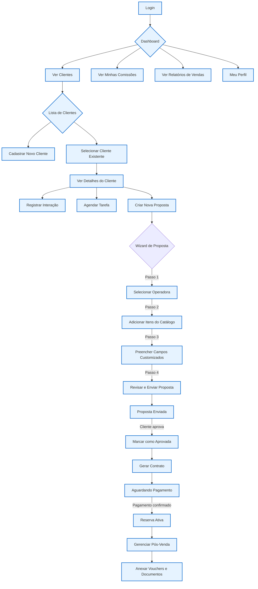

# Visão Geral da Aplicação: CRM SaaS para Agências de Viagens

## Resumo Executivo

Esta é uma plataforma de CRM (Customer Relationship Management) e gestão, desenvolvida como um serviço (SaaS) e desenhada especificamente para as necessidades de agências de viagens. A aplicação centraliza e otimiza todo o ciclo de vida do cliente, desde a captação e qualificação através de funis de venda, passando pela criação de propostas comerciais complexas com múltiplos produtos e operadoras, até a gestão de reservas ativas e o controle financeiro completo da agência.

A plataforma é construída com uma stack de tecnologia moderna, incluindo Next.js, React, TypeScript, Drizzle ORM e PostgreSQL, e é projetada para ser uma solução multi-tenant, onde cada agência de viagens que assina o serviço opera em um ambiente isolado e seguro.

## Principais Funcionalidades

A aplicação é dividida nos seguintes módulos principais:

### 1. Gestão de Clientes
- **Cadastro completo de clientes**: Informações pessoais, de contato, documentos e endereço.
- **Funil de vendas**: Acompanhamento da jornada do cliente através de etapas personalizáveis.
- **Interações**: Registro de todas as interações com o cliente (ligações, e-mails, reuniões).
- **Tarefas**: Agendamento de tarefas e lembretes para follow-ups.
- **Transferência de clientes**: Permite que administradores transfiram clientes entre agentes.

### 2. Gestão de Propostas
- **Criação de propostas**: Assistente passo a passo para criar propostas comerciais.
- **Itens personalizáveis**: Adição de produtos e serviços do catálogo, com campos customizáveis.
- **Cálculos automáticos**: Cálculo de subtotais, descontos e comissões.
- **Exportação**: Geração de propostas em PDF e formato para WhatsApp.
- **Ciclo de vida completo**: Acompanhamento do status da proposta (rascunho, enviada, aprovada, etc.).

### 3. Gestão de Reservas
- **Criação automática**: Reservas são criadas automaticamente a partir de propostas aprovadas.
- **Pós-venda**: Gestão de documentos, vouchers e pagamentos.
- **Timeline de eventos**: Histórico completo de todas as atividades da reserva.

### 4. Catálogo e Operadoras
- **Itens Base**: Criação de um catálogo de produtos e serviços genéricos (ex: "Passagem Aérea", "Hospedagem").
- **Campos Customizáveis**: Definição de campos específicos para cada tipo de item.
- **Gestão de Operadoras**: Cadastro de fornecedores e associação de itens do catálogo.
- **Comissionamento**: Definição de regras de comissão flexíveis por produto e forma de pagamento.

### 5. Gestão Financeira
- **Contas a Pagar e Receber**: Controle financeiro completo da agência.
- **Cálculo de Comissões**: Cálculo automático de comissões para os agentes.
- **Relatórios**: Relatórios de fluxo de caixa, DRE e performance de vendas.

### 6. Administração e Configurações
- **Gestão de Usuários**: Criação e gerenciamento de usuários com diferentes níveis de permissão (Master, Admin, Agent).
- **Configurações da Agência**: Personalização de temas, notificações e outras preferências.
- **Logs de Auditoria**: Registro de todas as ações críticas realizadas no sistema.

## Fluxograma da Experiência do Agente

Este fluxograma descreve a jornada típica de um agente de viagens utilizando a plataforma:

## Conclusão

A plataforma oferece uma solução completa e integrada para agências de viagens, com foco em flexibilidade, automação e controle. A arquitetura modular e a stack de tecnologia moderna garantem que a aplicação seja escalável, segura e fácil de manter, proporcionando uma base sólida para o crescimento do negócio.
