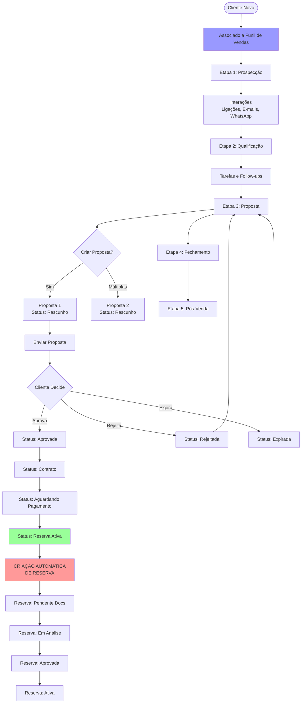

# Fluxograma do Sistema de Vendas

## 📊 Esclarecimento Importante sobre Funis

### ✅ CORRETO: 
- **CLIENTES têm funis** - O funil representa a jornada do cliente no processo de vendas
- Cada cliente está em uma etapa específica de um funil

### ❌ INCORRETO:
- **Propostas NÃO têm funis** - Propostas são documentos comerciais, não têm jornada própria
- Propostas são criadas PARA clientes que estão em funis

## 🔄 Fluxograma Principal



## 🎯 Relacionamento Detalhado

### 1. **Cliente ↔ Funil (1:1)**
```
Cliente (clients_new)
├── funnelId → sales_funnels.id
└── funnelStageId → sales_funnel_stages.id
```
- **Um cliente** está em **um funil** por vez
- **Um cliente** está em **uma etapa** específica do funil
- Cliente progride pelas etapas conforme evolui no processo comercial

### 2. **Cliente ↔ Propostas (1:N)**
```
Cliente
└── Pode ter múltiplas propostas
    ├── Proposta 1 (ativa)
    ├── Proposta 2 (expirada)
    └── Proposta 3 (rascunho)
```
- **Um cliente** pode ter **várias propostas**
- Propostas podem estar em diferentes status simultaneamente
- Propostas NÃO têm funil próprio

### 3. **Proposta ↔ Reserva (1:1)**
```
Proposta (status: active_booking)
└── Gera automaticamente → Reserva (bookings)
```
- **Uma proposta aprovada e paga** gera **uma reserva**
- Relação 1:1 entre proposta e reserva
- Trigger automático na mudança de status

## 📈 Cenários Práticos

### Cenário 1: Cliente com Múltiplas Propostas
```
João Silva (Cliente)
├── Funil: Vendas B2C
├── Etapa: Negociação
├── Propostas:
│   ├── #001 - Pacote Cancún (Rejeitada)
│   ├── #002 - Pacote Bahia (Expirada)
│   └── #003 - Pacote Fortaleza (Ativa → Reserva #BKG-001)
```

### Cenário 2: Progressão no Funil
```
Maria Santos (Cliente)
├── Dia 1: Etapa "Primeiro Contato"
│   └── Interação: Ligação inicial
├── Dia 5: Etapa "Qualificação"
│   └── Tarefa: Enviar informações
├── Dia 10: Etapa "Proposta"
│   └── Proposta #004 criada e enviada
├── Dia 15: Etapa "Negociação"
│   └── Proposta #004 aprovada
└── Dia 20: Etapa "Cliente Ativo"
    └── Reserva #BKG-002 criada
```

## 🔍 Perguntas e Respostas

### Q: Propostas têm funis?
**R: NÃO.** Propostas são documentos comerciais. O funil pertence ao CLIENTE que representa sua jornada de compra.

### Q: Clientes podem ter múltiplos funis?
**R: NÃO.** Um cliente está em apenas um funil por vez, mas pode mudar de funil se necessário (ex: migração de B2C para B2B).

### Q: Pode existir reserva sem proposta?
**R: NÃO.** Toda reserva é criada a partir de uma proposta com status `active_booking`.

### Q: Cliente pode ter múltiplas propostas ativas?
**R: SIM.** Um cliente pode ter várias propostas em diferentes status, para diferentes produtos ou períodos.

### Q: O que acontece com o funil quando uma proposta é rejeitada?
**R: NADA.** O cliente continua no funil normalmente. Pode-se criar nova proposta ou trabalhar outras oportunidades.

## 🎨 Estados e Transições

### Estados do Cliente no Funil:
1. **Prospect** → Primeiro contato
2. **Lead Qualificado** → Interesse confirmado
3. **Em Negociação** → Proposta em andamento
4. **Cliente** → Proposta aceita
5. **Cliente Ativo** → Com reserva ativa
6. **Pós-Venda** → Acompanhamento

### Estados da Proposta:
```
draft → sent → approved → contract → awaiting_payment → active_booking
         ↓        ↓                                           ↓
      expired  rejected                              [CRIA RESERVA]
```

### Estados da Reserva:
```
pending_documents → under_analysis → approved → active
                                        ↓
                                    cancelled/suspended
```

## 🚀 Automações do Sistema

1. **Cliente muda de etapa no funil**
   - Registra em `stage_transitions`
   - Notifica agente responsável

2. **Proposta aprovada e paga** 
   - Status muda para `active_booking`
   - **TRIGGER: Cria reserva automaticamente**
   - Cliente avança no funil para "Cliente Ativo"

3. **Reserva criada**
   - Copia dados da proposta para metadata
   - Inicia com status `pending_documents`
   - Notifica equipe operacional

## 📋 Resumo Executivo

```
FUNIL DE VENDAS (pertence ao CLIENTE)
     ↓
  CLIENTE 
     ↓
  PROPOSTAS (múltiplas, documentos comerciais)
     ↓
  RESERVAS (operacional, 1:1 com proposta aprovada)
```

- **Funis** = Jornada do cliente
- **Propostas** = Ofertas comerciais
- **Reservas** = Execução operacional

O sistema foi projetado para gerenciar o relacionamento com o cliente (CRM via funis) e simultaneamente controlar aspectos comerciais (propostas) e operacionais (reservas).